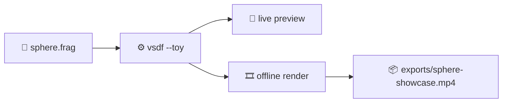

# 🌐 Example Sphere

<p align="center">
  
  
  
</p>

A tiny GLSL sphere study for [`vsdf`](https://github.com/jamylak/vsdf).

It raymarches a sphere, warps the surface with animated 3D noise, and shades it using the surface normal, which gives it that shifting false-color / topology-map look.

## ✨ What It Does

- Renders a procedural sphere from `sphere.frag`
- Uses `iTime` to animate the surface distortion
- Visualizes normals directly for a bold neon look
- Runs through `vsdf`'s ShaderToy-style wrapper with hot reload while you edit

## 🚀 Run It

```sh
vsdf --toy sphere.frag
```

## 🛠️ Install `vsdf`

On macOS, the upstream `vsdf` README currently recommends:

```sh
brew install jamylak/vsdf/vsdf
```

For full installation notes, install instructions on other platforms, and source builds, see:

- [`jamylak/vsdf`](https://github.com/jamylak/vsdf)

## 🎬 Export Assets

This repo includes a small export helper:

```sh
./scripts/export-assets.sh
```

It uses `vsdf`'s offline `--ffmpeg-output` path, so your `vsdf` install needs FFmpeg support for video export.

By default it renders a showcase MP4 to:

```text
exports/sphere-showcase.mp4
```

You can tweak the export without editing the script:

```sh
FRAMES=720 WIDTH=2560 HEIGHT=1440 FPS=60 ./scripts/export-assets.sh
```

## 🌀 Shader Flow



## 🌈 Orb Mood

```text
             .-=========-.
          .-'   🟣  🔵  🟢   '-.
        .'     animated noise    '.
       /      wrapped on a        \
      ;       raymarched orb       ;
      |     normals become color   |
      ;                            ;
       \      tweak, run, export  /
        '.                    .'
          '-.______________.-'
```
